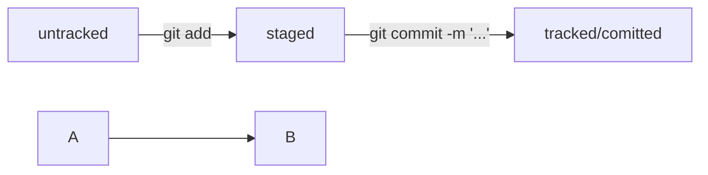
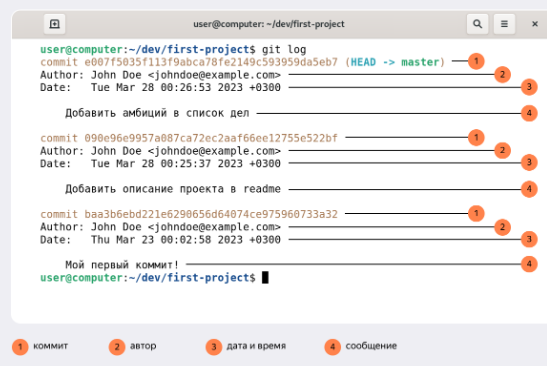
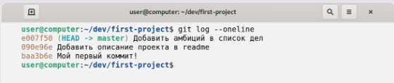
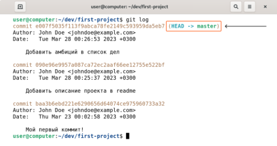

## **Commands console Git**

| **Command** | **Translate**                      | **Remark**                                 | **По Русски**                                                       |
|-------------|------------------------------------|--------------------------------------------|---------------------------------------------------------------------|
| cd (*)      | change directory                   | (*) - name of directory                    | Переход по папкам, пишем cd и через пробел имя папки куда переходим |
| cd ..       | come back in last directory        |                                            | Переход к предыдущей папке                                          |
| ls          | list                               |                                            | Осмотреться (команда показывает все файлы в текущей директории)     |
| pwd         | Print working directory            |                                            | Показывает текущую папку                                            |
| cd ~        | Return at home directory           |                                            | перейти в домашнюю директорию                                      |
| touch (*)   | Create a new file                  | (*) - name of creating file with extension | создать файл                                                        |
| mkdir (*)   | Make directory                     | (*) - name of new directory                | Создание новой папки в текущей                                      |
| cat (*)     | read file                          | (*) - name of file                         | чтение файла  (имя файла писать вместе с расширением)           |
| rmdir (*)   | Remove directory (if dir is empty) | (*) - name of remove directory             | Удаление папки, если она пустая                                     |
        

			

### Статусы untracked/tracked, staged и modified

каждый файл помечается каким-либо статусом.

1. Файл только что создали. Git ещё не отслеживает его содержимое. Состояние: untracked.
2. Файл добавили в staging area с помощью git add. Состояние: staged(+ tracked).
a. Возможно, изменили файл ещё раз. Состояния: staged, modified(+ tracked). 
Обратите внимание: staged и modified у одного файла, но у разных его версий.
b. Ещё раз выполнили git add. Состояние: staged(+ tracked).
3. Сделали коммит с помощью git commit. Состояние: tracked.
4. Изменили файл. Состояние: modified(+ tracked).
5. Снова добавили в staging area с помощью git add. Состояния: staged(+ tracked).
6. Сделали коммит. Состояния: tracked.
7. Повторили пункты 4−7 много-много раз.

   • _untracked_ (Untracked files) - неотслеживаемый 
Когда созданный новый файл еще не добавлен для отслеживания командой git add …

• _staged_ (Changes to be committed в выводе git status) - подготовленный
Такой статус после того, как файл стал отслеживаемым (теперь он готов к коммиту)

• _modified_ (Changes not staged for commit) - измененный
Когда после того как закоммитили файл, в него внесли правки.

Если после этого добавить измененный файл в staging area командой git add, 
то новый статус git status будет указывать что файл уже изменен (а не новый созданный) 
об этом указывает "modifided" перед именем файла.

### Хеш, лог и HEAD

#### _Хеш — идентификатор коммита_

_**Хеширование**_ (от англ. hash, «рубить», «крошить», «мешанина») — это способ преобразовать набор данных 
и получить их «отпечаток»(англ. fingerprint).
Информация о коммите — это набор данных: 
когда был сделан коммит, содержимое файлов в репозитории на момент коммита и ссылка на предыдущий, или родительский (англ. parent), коммит. 
Git хеширует (преобразует) эту информацию с помощью алгоритма SHA-1 
(от англ. Secure Hash Algorithm — «безопасный алгоритм хеширования») 
и получает для каждого коммита свой уникальный хеш — результат хеширования.

В то время, как результат работы метода hashCode()— это целое число, результат хеширования в Git — символьная строка. Она относительно коротка (40символов в случае SHA-1) и состоит из цифр 0—9 и латинских букв A—F(неважно, заглавных или строчных). Хеш обладает следующими важными свойствами:
• если хеш получить дважды для одного и того же набора входных данных, то результат будет гарантированно одинаковый;
• если хоть что-то в исходных данных поменяется (хотя бы один символ), то хеш тоже изменится (причём сильно).

Все хеши и таблицу хеш → информация о коммите Git сохраняет в служебные файлы.
Они находятся в скрытой папке .git в репозитории проекта.

#### _**лог**_

После вызова _git log_ появляется список коммитов с их описанием.

Если в репозитории уже много коммитов — например, сотни или тысячи, — пригодится сокращённый лог. С ним можно быстро найти нужный коммит по описанию.
Сокращённый лог вызывают командой _**git log**_ с флагом _--oneline_ (англ. «одной строкой»). При этом в терминале появятся только первые несколько символов хеша каждого коммита и комментарии к ним.

Сокращённый хеш (первые несколько символов полного) можно использовать точно так же, как и полный. Для этого команда git log --oneline автоматически подбирает такую длину сокращённых хешей, чтобы они были уникальными в пределах репозитория и Git всегда мог понять, о каком коммите идёт речь.

#### _**HEAD**_
При вызове команды _**git log**_  также можно заметить надпись (HEAD -> master) после хеша одного из коммитов.

Файл _**HEAD**_ (англ. «голова», «головной») — один из служебных файлов папки .git. Он указывает на коммит, который сделан последним (то есть на самый новый).

